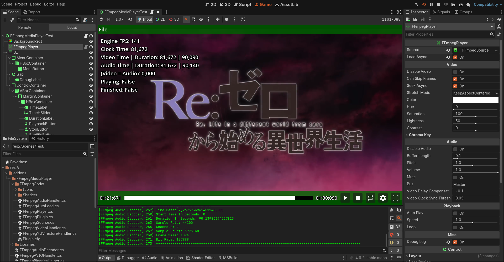

# FFmpeg Media Player For Godot

This project is an addon for the Godot Engine that integrates FFmpeg to decode and playing media files (video & audio) using FFmpeg.AutoGen C#.

## Preview

<p align="center">
  
</p>

## Features

- Load only Video / Audio
- Skip frames
- Video seeking async
- Stretch mode
- Color, Hue, Saturation, Lightness, Contrast
- Chroma Key
- Audio buffer length
- Pitch, Volume, Mute, Bus
- Auto playing
- Playback speed
- Looping
- Debug logging
- Load async
- Auto import/export media files via Godot Editor Plugin

## Limitations

- No hardware acceleration
- Only video files can import into the editor ("mp4", "webm", "mpg", "mpeg", "mkv", "avi", "mov", "wmv", "ogv")

## Requirements

- FFmpeg.AutoGen.Abstractions 8.1.0 nuget package
- FFmpeg.AutoGen.Bindings.DynamicallyLoaded 8.1.0 nuget package
- Godot Engine 4.6 or newer
- Dotnet 8.0+

## Installation

- Make sure you install the nuget packages

```
dotnet add package FFmpeg.AutoGen.Abstractions --version 8.1.0
dotnet add package FFmpeg.AutoGen.Bindings.DynamicallyLoaded --version 8.1.0
```

- Enable AllowUnsafeBlock in csproj file

```
<AllowUnsafeBlocks>true</AllowUnsafeBlocks>
```

- Your csproj file will look like this

```
<Project Sdk="Godot.NET.Sdk/4.7.0">
  <PropertyGroup>
    <EnableDynamicLoading>true</EnableDynamicLoading>
    <AllowUnsafeBlocks>true</AllowUnsafeBlocks>
    <TargetFramework>net8.0</TargetFramework>
  </PropertyGroup>
  <ItemGroup>
    <PackageReference Include="FFmpeg.AutoGen.Abstractions" Version="8.1.0"/>
    <PackageReference Include="FFmpeg.AutoGen.Bindings.DynamicallyLoaded" Version="8.1.0"/>
  </ItemGroup>
</Project>
```

- Copy the `addons/FFmpegMediaPlayer` folder into the root of your Godot project and build the C# code.

- Go to `Project -> Project Settings -> Plugins`, and enable the plugin.

- Now you need to download ffmpeg shared build first.

- Get all the files in the bin folder and put it in the "Libraries" folder based on your platform.

- Example Windows ->

- Download ffmpeg shared build for windows: https://github.com/GyanD/codexffmpeg/releases/tag/8.1.2

- Get all the "*.dll" files inside the "bin" folder and put it in the "Libraries/Windows-x64"

## Usage

- See FFmpegMediaPlayerTest.tscn

## License & Attribution

The plugin itself is MIT licence, when using FFmpeg shared library LGPL, GPL will also apply to your project based on FFmpeg licence itself.

The current shared library files are using is LGPL.